<div align="center">

# Free LLM API Hub

**A continuously-verified dataset of free LLM & AI-model APIs you can build on.**

Free LLM APIs plus adjacent model APIs — image, speech, embeddings, rerank and OCR. Free tiers, trial credits and no-cost quotas, every entry dated, sourced, and machine-readable.
No hype, no dead links, no "generous limits" hand-waving. Just what's actually free, and the fine print that bites.



[](https://github.com/pacocartones/free-llm-api-hub/actions/workflows/verify.yml)
[](#how-verification-works)
[](data/providers.json)
[](LICENSE)
[](CONTRIBUTING.md)

**[🔎 Interactive explorer](https://freellmapihub.com/)** &nbsp;·&nbsp; **[📊 Dataset](data/providers.json)** &nbsp;·&nbsp; **[🧪 How we verify](docs/methodology.md)** &nbsp;·&nbsp; **[➕ Add a provider](CONTRIBUTING.md)**

<!-- AUTOGEN:stats:start -->
**67 providers** tracked · 36 ongoing free tiers · 31 trial credits · **67/67** independently verified against the provider's own docs
<!-- AUTOGEN:stats:end -->

</div>

---

## Why this exists

Most "free LLM API" lists are a snapshot someone took once and never touched again. Rate limits get cut, docs URLs move, "free forever" quietly becomes "free for 30 days" — and the list keeps recommending it, confidently, for another year.

This project treats the list as a **maintained open dataset**, not a blog post:

- **Every entry is dated and sourced.** No `Last verified` date and a link to the provider's *own* docs? It doesn't ship as verified.
- **Freshness is measured, not claimed.** The badge above is computed from the data — it counts how many entries were re-confirmed in the last 90 days. When it decays, you can see it.
- **Links are checked automatically.** A scheduled job re-checks every source link and opens an issue the moment one breaks — the earliest signal a provider changed something.
- **Uncertainty is labelled, not hidden.** Entries we couldn't independently confirm are marked ⚠️ and say exactly what's unconfirmed, instead of being dressed up as fact.
- **The data is the source of truth.** [`data/providers.json`](data/providers.json) is validated against a [schema](data/schema.json); this README, the badge and the site are all *generated* from it, so they can never silently drift apart.

If you're picking an API to prototype on this afternoon, you want the fine print more than the marketing. That's the whole point of this repo.

> [!WARNING]
> Independent, community-maintained list — **not affiliated with, endorsed by, or sponsored by any provider below.** Free-tier terms change without notice. Always confirm against the provider's own docs (linked in every row) before you rely on anything here. Entries marked ⚠️ are sourced from community tracking and not yet independently re-confirmed — treat them as indicative.

## What's covered

Primarily **free LLM (text) APIs** — plus the adjacent model APIs a builder reaches for next: **image generation, speech (STT/TTS), embeddings, rerank and OCR**. Every category is held to the same verification bar. Breakdown is generated from the data:

<!-- AUTOGEN:coverage:start -->
| Category | Providers | Examples |
|---|---|---|
| **Text / LLM** | 43 | Google Gemini API, Groq, OpenRouter |
| **Speech (STT / TTS)** | 25 | Google Gemini API, Groq, Cloudflare Workers AI |
| **Embeddings** | 13 | Google Gemini API, Cloudflare Workers AI, Cohere |
| **Image generation** | 10 | Cloudflare Workers AI, HuggingFace, Jina AI |
| **Vision** | 9 | Google Gemini API, OpenRouter, Z.ai |
| **OCR / documents** | 8 | OCR.space, LlamaParse, Nanonets |
| **Rerank** | 6 | Cohere, Jina AI, Mixedbread |
<!-- AUTOGEN:coverage:end -->

Filter any category live in the [interactive explorer](https://freellmapihub.com/) or the [multimodal collection](collections/multimodal.md).

## TL;DR — pick by what you actually need

Each pick links to the full row, where the real limits and catches live.

| I want… | Start with | Why |
|---|---|---|
| **The smartest model, free** | [Google Gemini](#ongoing-free-tiers) | The only genuinely frontier-class model with a real free tier here — not just open weights |
| **The fastest inference** | [Groq](#ongoing-free-tiers) or [SambaNova](#ongoing-free-tiers) | Purpose-built inference chips — far faster than typical GPU-served APIs |
| **The most free volume/day** | [Cloudflare Workers AI](#ongoing-free-tiers) (10k Neurons) or [OpenRouter](#ongoing-free-tiers) (1k req/day) | Highest ceilings for a side project with real traffic |
| **No card *and* no phone** | [OpenRouter](#ongoing-free-tiers) or [Google Gemini](#ongoing-free-tiers) | Groq, Mistral, SiliconFlow and NVIDIA all gate signup behind phone verification |
| **Open weights** (Llama, DeepSeek, Qwen, GLM) | [OpenRouter](#ongoing-free-tiers) or [Cloudflare Workers AI](#ongoing-free-tiers) | Widest open-model selection on an ongoing free tier |
| **Permanently free, no trial clock** | [Z.ai (GLM)](#ongoing-free-tiers) or [SiliconFlow](#ongoing-free-tiers) | Several models priced at $0 indefinitely, not just for a trial window |
| **An OpenAI-compatible endpoint** | [Groq](#ongoing-free-tiers), [OpenRouter](#ongoing-free-tiers), [Cloudflare Workers AI](#ongoing-free-tiers) | Point the OpenAI SDK at a new `base_url` and you're done |
| **EU / data-sovereignty hosting** | [OVHcloud](#ongoing-free-tiers) or [Scaleway](#one-time-trial-credits) | French/EU providers; OVHcloud even has an anonymous, no-account tier |
| **Free embeddings & rerank** | [Jina AI](#one-time-trial-credits) or [Cohere](#ongoing-free-tiers) | 10M free tokens (Jina, OpenAI-compatible) or 1,000 calls/mo (Cohere) |
| **Free speech-to-text / TTS** | [Deepgram](#one-time-trial-credits) or [AssemblyAI](#one-time-trial-credits) | $200 / $50 in no-card credit for Whisper-class STT and TTS |
| **A bigger one-time credit** | [Deepgram](#one-time-trial-credits) ($200, speech) or [Baseten](#one-time-trial-credits) ($30, LLMs) | Largest credits in the list |
| **Something safe to ship commercially** | [Cloudflare Workers AI](#ongoing-free-tiers) or [Groq](#ongoing-free-tiers) | Don't restrict the free tier to personal/eval use, the way Cohere and NVIDIA do |

Starting points, not guarantees — read the full row before you build on it.

## Browse by need

Focused, always-current collections — each is generated from the dataset and has a live web page too.

<!-- AUTOGEN:collections:start -->
- **[Free LLM APIs with no credit card](collections/no-credit-card.md)** (39) — start without a payment method · [live page ↗](https://freellmapihub.com/collections/no-credit-card.html)
- **[Free LLM APIs with no phone verification](collections/no-phone.md)** (20) — no SMS/phone verification · [live page ↗](https://freellmapihub.com/collections/no-phone.html)
- **[Free LLM APIs for commercial use](collections/commercial-use.md)** (23) — safe to ship, not eval-only · [live page ↗](https://freellmapihub.com/collections/commercial-use.html)
- **[OpenAI-compatible free LLM APIs](collections/openai-compatible.md)** (31) — drop-in OpenAI SDK swap · [live page ↗](https://freellmapihub.com/collections/openai-compatible.html)
- **[Permanently free LLM APIs](collections/always-free.md)** (6) — $0 models, no trial clock · [live page ↗](https://freellmapihub.com/collections/always-free.html)
- **[Free multimodal LLM APIs](collections/multimodal.md)** (50) — vision, audio, embeddings · [live page ↗](https://freellmapihub.com/collections/multimodal.html)
<!-- AUTOGEN:collections:end -->

Every provider also has its own page with the full details and a copy-ready quickstart — e.g. [Groq](https://freellmapihub.com/p/groq.html), [Deepgram](https://freellmapihub.com/p/deepgram.html), [Jina AI](https://freellmapihub.com/p/jina-ai.html).

## Contents

- [What's covered](#whats-covered) — the categories, by the numbers
- [Browse by need](#browse-by-need) — curated collections by constraint
- [Ongoing free tiers](#ongoing-free-tiers) — recurring quotas that renew
- [One-time trial credits](#one-time-trial-credits) — a fixed balance, then pay-as-you-go
- [Notably NOT free](#notably-not-free) — so this list doesn't waste your time
- [How verification works](#how-verification-works) — the trust engine
- [Use the data](#use-the-data) — dataset, exports, badge
- [Contributing](#contributing) · [Project docs](#project-docs)

---

## Ongoing free tiers

Recurring (daily/monthly) quotas that renew — no expiry, but usually rate-limited and sometimes gated behind a phone number or restricted from commercial use.

<sub>💳 no card · 📵 no phone · 📱 phone required · 🏢 commercial OK · 🔬 eval only · 🔌 OpenAI-compatible</sub>

<!-- AUTOGEN:ongoing:start -->
| Provider | What's free | Rate limits | The catch | Verified |
|---|---|---|---|---|
| **[Google Gemini API (AI Studio)](https://ai.google.dev/gemini-api/docs/rate-limits)**<br><sub>💳 no card · 📵 no phone · 🏢 commercial OK · 🔌 OpenAI-compat</sub> | Gemini 2.5 Flash, 2.5 Flash-Lite, 2.5 Pro (limited), embeddings, TTS models | Varies by model: 5-30 RPM and 15-1,000 RPD (e.g. 2.5 Pro: 5 RPM/100 RPD; 2.5 Flash: 10/250; 2.5 Flash-Lite: 15/1,000; embeddings: 100 RPD; TTS: 15 RPD) | Free-tier prompts/outputs may be used by Google to improve its products outside the UK/CH/EEA/EU. Since the 2026-03-23 terms, only Paid Services may serve API clients to end users in the EEA/CH/UK | ✅ 2026-08-02 |
| **[Groq](https://console.groq.com/docs/rate-limits)**<br><sub>💳 no card · 📱 phone · 🏢 commercial OK · 🔌 OpenAI-compat</sub> | Open-weight models (Llama, Qwen, GPT-OSS) plus Whisper, no credit card required | e.g. llama-3.1-8b-instant: 30 RPM/14.4K RPD/6K TPM/500K TPD; llama-3.3-70b-versatile: 30 RPM/1K RPD/12K TPM/100K TPD; qwen/qwen3.6-27b: 30 RPM/1K RPD/8K TPM/200K TPD; similar for GPT-OSS and Whisper models | Limits apply at the organization level, not per API key. Phone verification required at signup | ✅ 2026-08-02 |
| **[OpenRouter](https://openrouter.ai/docs/api-reference/limits)**<br><sub>💳 no card · 📵 no phone · 🏢 commercial OK · 🔌 OpenAI-compat</sub> | A rotating set of models with a :free suffix (~14 today; count fluctuates), single API across many providers | 20 req/min; 50 req/day under 10 credits purchased lifetime, 1000 req/day once 10+ credits purchased (one-time, not a subscription) | ToS (Jul 2026) prohibits reselling API access or building a competing service — platform-wide, not just the free models; per-model terms still apply | ✅ 2026-08-02 |
| **[Cloudflare Workers AI](https://developers.cloudflare.com/workers-ai/platform/pricing/)**<br><sub>💳 no card · 📵 no phone · 🏢 commercial OK · 🔌 OpenAI-compat</sub> | 10,000 Neurons/day, all account plans | 30+ models: LLMs (Llama, Mistral, DeepSeek, Qwen...), embeddings, image, audio | Resets daily at 00:00 UTC; overage on a Workers Paid plan bills at $0.011/1,000 Neurons. A few models (e.g. Kimi K2.6/K2.7-code, GLM-5.2) now require a Workers Paid plan | ✅ 2026-08-02 |
| **[Cohere](https://docs.cohere.com/docs/rate-limits)**<br><sub>💳 no card · 📵 no phone · 🔬 eval only · 🔌 OpenAI-compat</sub> | Trial (evaluation) API keys covering chat, embed and rerank | 1,000 API calls/month total; 20 req/min chat; 2,000 inputs/min embed; 10 req/min rerank | Explicitly for evaluation only — Cohere's terms prohibit production/commercial use on a trial key | ✅ 2026-07-30 |
| **[Mistral (La Plateforme)](https://docs.mistral.ai/admin/billing-usage/usage-limits)**<br><sub>📱 phone · 🔬 eval only</sub> | "Restrictive" free tier explicitly for "try and explore" — official docs say to upgrade for "actual projects and production use" | Not published publicly; exact caps only visible in-console after login (admin.mistral.ai) | Phone verification required to activate; free tier is opt-in for data training | ✅ 2026-07-12 |
| **[HuggingFace](https://huggingface.co/docs/inference-providers/en/pricing)**<br><sub>💳 no card · 🔌 OpenAI-compat</sub> | Free CPU Basic + ZeroGPU for Spaces; Inference Providers has a monthly credit ($0.10/mo on Free plan, $2.00/mo on PRO/Team/Enterprise) | No RPM/TPM published, only credit amounts | Credits only apply with "Routed by Hugging Face" billing, not with a Custom Provider Key | ✅ 2026-07-30 |
| **[SiliconFlow](https://docs.siliconflow.cn/en/userguide/rate-limits/rate-limit-and-upgradation)**<br><sub>📱 phone · 🔌 OpenAI-compat</sub> | Several models permanently free (e.g. Qwen2.5-7B-Instruct and others) at $0 cost, plus a $1 welcome credit for paid models | Fixed per-model limits for free models; generic docs cite ranges of 1,000-10,000 RPM and 50,000-5,000,000 TPM depending on model tier — exact limits shown in-account | Signup requires SMS phone verification. Full "real-name authentication" (needed for recharging/billing) requires a mainland China, Hong Kong/Macao, or Taiwan ID document — this may limit full access for users without one, though basic use of free models appears reachable with standard account verification | ✅ 2026-07-30 |
| **[Z.ai (Zhipu AI / GLM)](https://docs.z.ai/guides/overview/pricing)**<br><sub>📵 no phone · 🏢 commercial OK · 🔌 OpenAI-compat</sub> | GLM-4.5-Flash, GLM-4.7-Flash (text), and GLM-4.6V-Flash (vision) are officially listed as $0 cost (input, cached input, and output) on a permanent basis | Not specified with concrete RPM/TPM figures in public docs | Terms of Use prohibit using the service to "develop, train, or improve" competing algorithms or models — otherwise general use, including commercial, isn't restricted | ✅ 2026-07-30 |
| **[IBM watsonx.ai (Lite plan)](https://www.ibm.com/docs/en/watsonx/saas?topic=cloud-watsonxai-runtime-plans)**<br><sub>💳 card required · 🔌 OpenAI-compat</sub> | Lite plan: 300,000 tokens/month for foundation model inference, 20 CUH/month for ML tooling, 100 pages/month of document text extraction | 2 inference requests per second (explicitly documented for the Lite plan) | Lite plan doesn't support fine-tuning of foundation or custom models; 1-day idle deployment timeout. Never expires or bills while inside quota, but a payment method (with a nominal ~$1 authorization hold) is required at signup | ✅ 2026-07-11 |
| **[OVHcloud AI Endpoints](https://www.ovhcloud.com/en/public-cloud/ai-endpoints/catalog/)**<br><sub>💳 card required · 🔌 OpenAI-compat</sub> | Two Qwen3Guard models (Gen-8B and Gen-0.6B) are currently listed as Free in the catalog; access is available anonymously or with an API key tied to a Public Cloud project | Anonymous access: 2 requests/min per IP per model. Authenticated (API key): 400 requests/min per project per model. Exceeding either returns HTTP 429 | European provider (France), relevant for EU data-sovereignty/GDPR-conscious use. The authenticated tier needs a valid payment method on the project (though "Free" models themselves don't charge); anonymous access needs neither an account nor a card. A separate general $200 Public Cloud trial voucher also exists but is unrelated to this free-model tier | ✅ 2026-08-03 |
| **[SambaNova Cloud](https://cloud.sambanova.ai/plans)**<br><sub>💳 no card · 🏢 commercial OK · 🔌 OpenAI-compat</sub> | Rate-limited free tier (applies when no payment method is linked) across all models | Free Tier: 20 RPM / 20 RPD / 200,000 TPD across all models; Developer Tier (card required): 60-240 RPM depending on model | Free Tier applies when no payment method is linked to the account; SambaCloud ToS grants a commercial license (no evaluation-only clause). The previously-listed "$5 / 3 months" trial could not be re-confirmed on official pages (2026-07-30). | ✅ 2026-07-30 |
| **[Arli AI](https://www.arliai.com/pricing)**<br><sub>🔌 OpenAI-compat</sub> | Free plan ($0): access to all text LLMs (Gemma, Qwen, etc.), capped at ~5 requests per 2-day window, 12K context, 1 request at a time | 1 request at a time; ~5 requests per 2 days across all models; max 12K context; delayed responses | Free tier is for testing only — very restrictive. Provider advertises zero-log / no data retention. Card requirement for the free tier is not stated on the pricing page. | ✅ 2026-07-30 |
| **[Ollama Cloud](https://docs.ollama.com/cloud)**<br><sub>💳 no card · 📵 no phone · 🏢 commercial OK · 🔌 OpenAI-compat</sub> | $0 Free plan: access to cloud-hosted open models (Qwen, GPT-OSS, DeepSeek, etc.) via API | Session limits reset every 5 hours and weekly limits every 7 days; 1 concurrent cloud model on the free plan (exact token caps not published) | First-party — Ollama hosts the cloud models. Requires an ollama.com account + API key (`ollama signin`); the free plan is for light usage, Pro ($20/mo) raises limits. No card required. | ✅ 2026-07-30 |
| **[AI Horde](https://aihorde.net/)**<br><sub>💳 no card · 📵 no phone</sub> | Free crowdsourced text & image generation; anonymous API key '0000000000' (no registration), or register to earn kudos for priority | Queue-based priority via kudos (no fixed quota); anonymous requests get lowest priority under load | Community-powered volunteer network — model availability and speed vary with worker supply, so it is not a fixed-SLA service. No card, no phone. Kudos never expire and cannot be sold. | ✅ 2026-07-30 |
| **[ModelScope (API-Inference)](https://www.modelscope.cn/docs/model-service/API-Inference/intro)**<br><sub>💳 no card · 🔬 eval only · 🔌 OpenAI-compat</sub> | ~2,000 free API calls/day across open-weight models (Qwen3, DeepSeek, GLM, Llama, etc.) via API-Inference | ~2,000 calls/day; concurrency/QPS caps applied and dynamically adjusted | Alibaba's model hub — a different product from Alibaba Model Studio. Requires a ModelScope account bound to an Alibaba Cloud account with real-name (ID) verification — a practical barrier for non-China users. Explicitly non-commercial ("for developers to experience"). No card. | ✅ 2026-07-30 |
| **[Pollinations.ai](https://github.com/pollinations/pollinations/blob/master/APIDOCS.md)**<br><sub>💳 no card · 📵 no phone</sub> | Free hosted image models (Flux, Turbo, Stable Diffusion) via a simple GET URL; also text and audio. No signup required to start | Anonymous ~1 request / 15s; free registration (Seed tier) ~1 request / 5s | Anonymous free images may carry a watermark (since 2025); free registration removes it via the nologo parameter. No card, no phone. Commercial use is not explicitly guaranteed in the docs. | ✅ 2026-07-30 |
| **[Pinecone Inference](https://www.pinecone.io/pricing/)**<br><sub>💳 no card</sub> | Starter (free) plan: 5M tokens/mo for embedding models (llama-text-embed-v2, multilingual-e5-large) and 500 requests/mo for the bge-reranker-v2-m3 rerank model | 5M embedding tokens/mo; 500 rerank requests/mo on Starter | Free rerank limited to bge-reranker-v2-m3; overages are pay-as-you-go. Not OpenAI-compatible. No card required. | ✅ 2026-07-30 |
| **[Twelve Labs (Marengo Embed)](https://www.twelvelabs.io/pricing)**<br><sub>💳 no card</sub> | Free plan: the Marengo Embed API for all input types (video, audio, image, text) at no cost, plus ~600 min indexing | Embed video/audio: 3,000 RPD, 25 RPM; embed text/image: 3,000 RPD, 600 RPM | No credit card for the Free plan, but indexed data expires after 90 days unless upgraded. Marengo produces multimodal embeddings. Not OpenAI-compatible. | ✅ 2026-07-30 |
| **[OCR.space](https://ocr.space/OCRAPI)**<br><sub>💳 no card · 📵 no phone · 🏢 commercial OK</sub> | 25,000 conversions/month (Engine 1 & 2) plus 2,500 Engine 3 conversions/month; max 1 MB file, PDFs up to 3 pages | 500 requests per day per IP address | Free searchable-PDF output carries a watermark (raw text extraction is unrestricted); the free key needs only an email, no card. Commercial use permitted. | ✅ 2026-07-30 |
| **[LlamaParse (LlamaCloud)](https://www.llamaindex.ai/pricing)**<br><sub>💳 no card · 📵 no phone · 🏢 commercial OK</sub> | Free plan: 10,000 credits/month (~10,000 pages in balanced parse mode at 1 credit/page) | 5 concurrent jobs; 1 project; 5 indexes on the free plan | Credit-based (1,000 credits = $1.25); premium parse modes consume more credits per page. No card required. Document parsing for RAG (LlamaIndex). | ✅ 2026-07-30 |
| **[Moondream Cloud](https://moondream.ai/pricing)**<br><sub>🔌 OpenAI-compat</sub> | $5/month usage credits in every workspace (Free plan) for the Moondream vision model — caption, query (VQA), detect, point | Bounded by the $5/month credit | Recurring $5/month credit; card requirement not stated on the pricing page; commercial terms not specified. OpenAI-compatible endpoint. | ✅ 2026-07-30 |
| **[Speechmatics](https://www.speechmatics.com/pricing)**<br><sub>💳 no card</sub> | 3,000 minutes (50 hours)/month speech-to-text + 1,000,000 characters (~20 hrs)/month text-to-speech | 2 concurrent real-time sessions on the free plan | No credit card required to start; add a card only when you exceed the free limit. Recurring monthly allowance covering both STT and TTS. Commercial-use permission not explicitly stated on the pricing page. | ✅ 2026-07-30 |
| **[Speechify API](https://speechify.ai/pricing)**<br><sub>💳 no card · 📵 no phone · 🏢 commercial OK</sub> | 50,000 characters/month TTS (hard cap) + 60 min/month voice agents | 3 concurrent calls; hard cap pauses at the limit (no overages) | Commercial use is allowed on the free tier. No credit card required. Hard monthly cap that pauses at the limit. | ✅ 2026-07-30 |
| **[Hume AI (Octave TTS)](https://www.hume.ai/pricing)**<br><sub>💳 no card · 🏢 commercial OK</sub> | 10,000 characters/month TTS (~10 minutes) on the Free plan | 15 requests per minute | The free plan includes a commercial license; overage billed at $0.15/1,000 chars. No card stated as required to start. Not OpenAI-compatible. | ✅ 2026-07-30 |
| **[Unreal Speech](https://unrealspeech.com/pricing)**<br><sub>🏢 commercial OK</sub> | 250,000 characters/month TTS (~6 hours of audio) | Tiered endpoints for different text lengths; specific caps not documented | Commercial use allowed, but free-plan users must attribute Unreal Speech with a link when publishing audio. First-party REST endpoints. Card requirement not stated. | ✅ 2026-07-30 |
| **[ElevenLabs](https://elevenlabs.io/pricing)**<br><sub>💳 no card · 📵 no phone · 🔬 eval only</sub> | 10,000 credits/month shared across Text-to-Speech, Speech-to-Text and more (~10 min TTS/month) | Concurrency tied to the Free plan (not numerically published) | The free tier is NON-COMMERCIAL only per the Terms of Use (a commercial license begins on paid Starter, $6/mo), and historically required attribution. API access is available on the free plan. No credit card to sign up. | ✅ 2026-07-30 |
| **[Cartesia](https://cartesia.ai/pricing)**<br><sub>🔬 eval only</sub> | 20,000 credits/month (~27 min of Sonic TTS or ~1h51 of Ink speech-to-text) | 2 concurrent TTS requests, 8 concurrent STT; 20,000 credits/month | Commercial use is NOT allowed on the free plan (the $5/mo Pro plan adds a commercial licence). Low-latency streaming voice over WebSocket/REST; own API (not OpenAI-shaped). | ✅ 2026-07-31 |
| **[LMNT](https://www.lmnt.com/pricing)**<br><sub>🔬 eval only</sub> | 15,000 characters/month of TTS, with unlimited voice clones | 15,000 characters/month | Commercial use is not included on the free tier (the paid Indie plan and above add a commercial licence). Real-time streaming speech API. | ✅ 2026-07-31 |
| **[Fish Audio](https://fish.audio/plan/)**<br><sub>💳 no card · 🔬 eval only</sub> | 8,000 credits/month (~7 min of generation, up to 500 characters per generation); TTS, STT and voice cloning | 500 characters per generation; 8,000 credits/month | Free plan is personal, non-commercial only (commercial use requires a Premium subscription). No credit card required to sign up. | ✅ 2026-07-31 |
| **[Camb.ai](https://www.camb.ai/pricing)** | 2,000 credits/month covering ~25K characters of MARS TTS, 125 min of STT, plus limited watermarked dubbing and translation (incl. 5 OCR pages) | 500 chars/generation TTS, 15 min/generation STT; 2,000 credits/month | Uses its own MARS8 voice models (not OpenAI-compatible). Dubbing output on the free tier is watermarked. Card and commercial terms not stated on the pricing page. | ✅ 2026-07-31 |
| **[Unstructured](https://unstructured.io/pricing)**<br><sub>💳 no card</sub> | 15,000 pages/month, resets monthly — document parsing/OCR across 50+ file types (layout, tables, generative OCR enrichment) | 15,000 pages/month | No credit card required. Purpose-built to turn documents into clean, structured input for RAG/LLM pipelines. Commercial terms not stated on the pricing page. | ✅ 2026-07-31 |
| **[Nutrient (Data Extraction API)](https://www.nutrient.io/api/pricing/)**<br><sub>💳 no card</sub> | 5,000 credits/month (renews; no rollover) — ~5,000 text-parse pages, fewer for OCR-heavy 'Understand'/'Agentic' parsing (9-18 credits/page) | 5,000 credits/month; per-page cost varies by parse mode (1-18 credits) | No credit card required. Formerly PSPDFKit. Extraction/OCR with tables, key-value and handwriting. Commercial terms not stated on the pricing page. | ✅ 2026-07-31 |
| **[Photoroom](https://www.photoroom.com/api/pricing)**<br><sub>💳 no card</sub> | 10 free production calls on the Remove Background API (one-time) plus 1,000 sandbox calls/month on the Image Editing API (watermarked) | 1,000 sandbox calls/month; 10 one-time production calls | No credit card required. Sandbox output is watermarked (for testing); the 10 production calls return clean output. Image editing/generation (AI backgrounds, relighting, shadows). | ✅ 2026-07-31 |
| **[Poolside](https://docs.poolside.ai/api/overview)**<br><sub>🔌 OpenAI-compat</sub> | Laguna XS 2.1 (33B) and Laguna S 2.1 (118B) are free in Preview via a self-serve developer API key | Preview rate limits not published | Coding-focused models. Free access is Preview-stage and may change at general availability. Self-serve: create a free API key at platform.poolside.ai. OpenRouter is offered only as an alternative route. | ✅ 2026-07-31 |
| **[Veryfi](https://www.veryfi.com/pricing/)**<br><sub>💳 no card · 🏢 commercial OK</sub> | Free Forever plan: up to 100 documents/month — OCR plus structured data extraction (receipts, invoices, and 100+ document types) | 100 documents/month on the free plan | No credit card required. The 'Free Forever' 100 docs/mo tier is the standing free tier (a separate 14-day trial unlocks paid features). Proprietary OCR / document-intelligence REST API. | ✅ 2026-07-31 |
<!-- AUTOGEN:ongoing:end -->

## One-time trial credits

A fixed credit balance on signup. Once it's spent (or the clock runs out), you're on pay-as-you-go. Entries marked ⚠️ couldn't be confirmed against accessible official sources and are flagged for follow-up rather than presented with false confidence.

<!-- AUTOGEN:trial:start -->
| Provider | Credit | Models / notes | Expires | Verified |
|---|---|---|---|---|
| **[Cerebras](https://inference-docs.cerebras.ai/support/rate-limits)**<br><sub>💳 card required · 🏢 commercial OK · 🔌 OpenAI-compat</sub> | $5 in free credits for new accounts, usable across all public models | A verified payment method is required to activate Playground/API access (no charge until you buy credits). Credits expire 30 days after grant; whether any free access persists past expiry is not stated | 30 days | ✅ 2026-08-02 |
| **[Fireworks AI](https://docs.fireworks.ai/faq-new/billing-pricing/)**<br><sub>💳 no card · 🔌 OpenAI-compat</sub> | $1 trial credit | Fireworks uses prepaid credits. After the $1 credit is exhausted, add a payment method and credits (or enable auto top-up) to continue; account limits can rise with spend | — | ✅ 2026-08-03 |
| **[Baseten](https://www.baseten.co/pricing/)**<br><sub>🔌 OpenAI-compat</sub> | New accounts receive free credits; Baseten's current pricing page does not state the amount | Basic is $0/month, pay as you go. Current pricing confirms new-account credits but does not publish an amount or expiration date | — | ✅ 2026-08-03 |
| **[Nebius AI Studio](https://docs.tokenfactory.nebius.com)**<br><sub>💳 card required · 📵 no phone · 🏢 commercial OK · 🔌 OpenAI-compat</sub> | $1 trial credit, valid for 30 days | Product renamed to "Nebius Token Factory"; a bank card is required to set up billing | 30 days | ✅ 2026-07-30 |
| **[Novita AI](https://novita.ai/pricing)**<br><sub>💳 no card · 🔌 OpenAI-compat</sub> | $100 Sandbox credits, valid for 90 days | Official signup advertises $100 Sandbox credits valid for 90 days; no credit card required | 90 days | ✅ 2026-08-03 |
| **[AI21 Labs](https://docs.ai21.com/docs/usage-cost)**<br><sub>💳 no card</sub> | $10 trial credit, valid 3 months | Card not required for the trial credit itself, required once it expires | 3 months | ✅ 2026-08-03 |
| **[NLP Cloud](https://nlpcloud.com/pricing.html)**<br><sub>💳 card required · 📵 no phone · 🏢 commercial OK</sub> | $15 trial credit | Corrected: the official registration page does not ask for a phone number, contradicting the earlier listing | — | ✅ 2026-07-30 |
| **[Alibaba Cloud (Model Studio)](https://www.alibabacloud.com/help/en/model-studio/new-free-quota)**<br><sub>💳 no card · 🔌 OpenAI-compat</sub> | 1,000,000 tokens (example figure, varies by model), international/Singapore region only | Excludes batch processing, context caching, fine-tuning, and dedicated deployment | 30-90 days | ✅ 2026-07-30 |
| **[Modal](https://modal.com/pricing)** | $30/month recurring credit (Starter plan) | Corrected from a previously listed "$5-30/month" range; this is a recurring monthly credit, not a one-time trial. Modal is serverless compute you deploy models on, not a hosted model API | — | ✅ 2026-07-30 |
| **[Scaleway Generative APIs](https://www.scaleway.com/en/pricing/model-as-a-service/)**<br><sub>🔌 OpenAI-compat</sub> | 1,000,000 tokens free + 60 min Whisper transcription; billing starts at token 1,000,001 | European provider (France). Free allowance is a one-time token bucket, not time-limited | — | ✅ 2026-07-30 |
| **[NVIDIA NIM](https://build.nvidia.com/)**<br><sub>📱 phone · 🔬 eval only · 🔌 OpenAI-compat</sub> | Trial credit, phone verification required | "Evaluation only, not production" per NVIDIA's own Trial Terms of Service — NVIDIA may discontinue the trial at any time with no continuity obligation | — | ✅ 2026-07-11 |
| **[Vercel AI Gateway](https://vercel.com/docs/ai-gateway/pricing)**<br><sub>💳 no card · 🔌 OpenAI-compat</sub> | Free tier with a monthly free credit covering a subset of models at lower rate limits | Free tier and its monthly-credit behaviour are confirmed in Vercel's own docs; the specific "$5/month" figure circulating in community posts is not stated there. Once you purchase credits, your account moves to the paid tier and the monthly free credit no longer applies. | — | ✅ 2026-07-30 |
| **[Jina AI](https://jina.ai/embeddings/)**<br><sub>💳 no card · 📵 no phone · 🏢 commercial OK · 🔌 OpenAI-compat</sub> | 10M free tokens (one-time) across all models — embeddings (v3/v4), rerankers, classifier; plus a keyless Reader (r.jina.ai) for basic use | The 10M-token balance is a one-time grant that does not replenish; the keyless Reader is genuinely ongoing. Hosted API is commercial-OK and data is not used for training. No card required. | — | ✅ 2026-07-30 |
| **[Deepgram](https://deepgram.com/pricing)**<br><sub>💳 no card · 📵 no phone · 🏢 commercial OK</sub> | $200 free credit on signup (no card, no expiration) — Nova speech-to-text and Aura text-to-speech at pay-as-you-go rates | No card and no expiration on the credit. Data catch: the Model Improvement Program is opt-OUT — send mip_opt_out=true per request to keep your data out of training. Native REST/WebSocket API, not OpenAI-compatible. | — | ✅ 2026-07-30 |
| **[AssemblyAI](https://www.assemblyai.com/pricing)**<br><sub>💳 no card · 📵 no phone · 🏢 commercial OK · 🔌 OpenAI-compat</sub> | $50 free credit on signup (no card) — pre-recorded & streaming speech-to-text, Speech Understanding, and an OpenAI-compatible LLM Gateway (25+ models) | One-time credit, not renewing. Catch: the default model differs between free and paid accounts — set speech_models explicitly to avoid cost jumps on upgrade. Only the LLM Gateway is OpenAI-compatible. | — | ✅ 2026-07-30 |
| **[Mixedbread](https://www.mixedbread.com/pricing)**<br><sub>💳 no card · 📵 no phone · 🏢 commercial OK</sub> | Starter plan: $5 one-time credit (no card) — embeddings (mxbai-embed-large-v1), reranking, and multimodal search over PDF/image/doc/code | Free credit is usage-based and non-renewing; usage-based pricing applies afterward. Native REST API, not documented as OpenAI-compatible. No card required. | — | ✅ 2026-07-30 |
| **[Clarifai](https://docs.clarifai.com/control/account-billing/)**<br><sub>💳 no card · 📱 phone · 🔌 OpenAI-compat</sub> | One-time $5 credit across serverless models (GPT-OSS-120B, Claude, Llama), vision, embeddings and image generation | Catch: SMS phone verification is required to claim the $5. Credit is one-time and expires 30 days after grant; a card is required to recharge afterward. | 30 days | ✅ 2026-07-30 |
| **[Runware](https://runware.ai/pricing)**<br><sub>💳 no card · 📵 no phone · 🏢 commercial OK</sub> | $2 in signup credits across first-party image models (FLUX.1/FLUX.2, Stable Diffusion 3, SDXL) on the Sonic Inference Engine — hundreds to thousands of generations | The $2 requires signup with a business email (personal/free-mail domains may be rejected); one-time, non-renewing. No watermark, no card, commercial use allowed. The OpenAI-compatible endpoint is chat-only, not for images. | — | ✅ 2026-07-30 |
| **[Nanonets](https://nanonets.com/pricing)**<br><sub>💳 no card · 📵 no phone · 🏢 commercial OK</sub> | $50 in free credits on signup (one-time) across data-extraction / OCR workflows | One-time signup credit, not renewing; no credit card required to start. Paid plans start at $100/month afterwards. | — | ✅ 2026-07-30 |
| **[Sarvam AI](https://docs.sarvam.ai/api/getting-started/pricing)**<br><sub>🔌 OpenAI-compat</sub> | ₹100 in free credits on signup, usable across all APIs including the Sarvam-M chat/LLM API and speech (STT/TTS) | One-time signup credit shared across all APIs; card/phone requirement not stated on the docs. India-focused provider (pricing in INR), strong Indic-language models. | — | ✅ 2026-07-30 |
| **[Gladia](https://www.gladia.io/pricing)** | €50 in free credits on signup for speech-to-text (~80+ hrs pre-recorded or 60+ hrs real-time at current rates) | One-time grant with no monthly reset; prepaid model — top up once the credit is consumed. Card requirement not explicitly stated on the pricing page. | — | ✅ 2026-07-30 |
| **[Rime](https://rime.ai/pricing)** | 3,000 free TTS minutes for every new account (Starter plan) | One-time allotment on signup; card requirement and commercial-use terms for the free minutes are not stated on the pricing page. | — | ✅ 2026-07-30 |
| **[Tencent Hunyuan](https://cloud.tencent.com/document/product/1729/97731)**<br><sub>🔌 OpenAI-compat</sub> | 1,000,000 free tokens for Hunyuan text LLMs (hunyuan-a13b, turbos, translation & vision models), plus a separate 1,000,000-token allotment for hunyuan-embedding | Free resource package valid 1 year from activation; unused tokens expire. Tencent Cloud generally requires mainland-China real-name ID verification to activate — a practical barrier for non-China users. Commercial-use terms not stated on the free-quota page. | 1 year | ✅ 2026-07-30 |
| **[Voyage AI](https://docs.voyageai.com/docs/pricing)**<br><sub>💳 no card</sub> | 200M free tokens on current embedding models (voyage-4, voyage-4-lite, voyage-context-4, voyage-code-3) and on rerankers (rerank-2.5 family); voyage-multimodal-3.5 gets 200M text tokens + 150B pixels — a large one-time complimentary allotment per model | The allotment is a one-time complimentary balance per model, not a renewing monthly quota. No credit card required to claim. Owned by MongoDB — a first-party model provider, not a proxy. | — | ✅ 2026-07-31 |
| **[Contextual AI](https://contextual.ai/pricing/)** | $25 in free credits on the on-demand plan, usable on the Rerank (rerank-v2) and Generate APIs | One-time signup credit (does not renew); the instruction-following reranker is the standout free capability. Commercial-use terms not stated on the pricing page. | — | ✅ 2026-07-31 |
| **[Rev AI](https://www.rev.ai/pricing)** | Free credits equivalent to 5 hours of Reverb ASR (speech-to-text), usable across all Rev AI products | One-time signup grant (does not renew). High-accuracy English ASR. Card and commercial terms not stated on the pricing page. | — | ✅ 2026-07-31 |
| **[Upstage](https://console.upstage.ai/docs/getting-started)**<br><sub>💳 no card · 🏢 commercial OK · 🔌 OpenAI-compat</sub> | $10 in free credit on signup (no card) — Solar LLM (chat + embeddings) plus Document Parse / OCR / information extraction | No credit card required to receive the $10 credit; Studio agents also include 10 free runs. A separate institutional grant (up to 1 year of free Solar + Document Parse) exists for eligible organizations only. Credit validity period not stated. | — | ✅ 2026-07-31 |
| **[Voicegain](https://www.voicegain.ai/pricing)**<br><sub>💳 no card</sub> | $50 in free credits on signup (no credit card) — speech-to-text | No credit card required to start — an explicit $50 developer credit. Commercial terms not stated on the pricing page. Native STT REST API. | — | ✅ 2026-07-31 |
| **[Smallest.ai (Waves)](https://smallest.ai/pricing)** | $10 in free credits with full access — TTS, STT, speech-to-speech and voice cloning | $10 signup credit with full access. Fast TTS plus voice cloning. Card and commercial terms not stated on the pricing page. | — | ✅ 2026-07-31 |
| **[Retell AI](https://www.retellai.com/pricing)** | $10 in free credits plus 20 free concurrent calls — voice-agent orchestration (STT + LLM + TTS) | $10 signup credit with full platform access. A voice-agent builder (orchestration), not a raw model API. Card terms not stated on the pricing page. | — | ✅ 2026-07-31 |
| **[Datalab (Marker / Surya)](https://documentation.datalab.to/)** | $5 in free credits for new accounts — OCR in 90+ languages, PDF-to-markdown, tables, forms and structured extraction | $5 signup credit. The hosted API wraps the well-regarded open-source Marker/Surya OCR engine. Card and commercial terms not stated on the docs. | — | ✅ 2026-07-31 |
<!-- AUTOGEN:trial:end -->

## Notably NOT free

Worth saying plainly. As of the last verification pass, **OpenAI, Anthropic and xAI do not offer an ongoing free API tier.** Several providers people *assume* are free — **Together AI, DeepInfra, Perplexity's API, Replicate, Featherless AI** — currently require a card or prepayment before any API use, per their own docs. Some have handed out small one-time trial credits at various points, but that's changed repeatedly; check each provider's billing page before assuming anything.

For genuinely free access to strong models, your best bets here are **Gemini** (frontier-class) and the free open-weight models on **Groq, OpenRouter, Cloudflare, SiliconFlow and Z.ai**.

Retired or removed after re-verification: **GitHub Models** (fully retired by GitHub on 2026-07-30 — playground, catalog and inference API shut down for all customers), **Cerebras** (moved to the trial-credit table: the ongoing free tier became a payment-method-gated $5/30-day trial), **Inference.net** (the free tier is gateway/observability only, not free model tokens), and **Hyperbolic** (requires a $5 minimum deposit before any use).

## How verification works

Free-tier terms move fast, and most lists go stale silently. This one is built to surface drift instead of hiding it. Full details in **[docs/methodology.md](docs/methodology.md)**; the short version:

1. **Every verified entry carries a `last_verified` date** and a link to the provider's *own* docs. No date + primary source → it ships as ⚠️ unverified, not as fact.
2. **A scheduled GitHub Action** ([`maintenance.yml`](.github/workflows/maintenance.yml)) re-checks every source link weekly and opens/updates a tracking issue if any break — an early warning that a provider changed something.
3. **The freshness badge is computed from the data,** not written by hand: it is graded on the **oldest** verification in the list, straight from [`providers.json`](data/providers.json). Green while every entry is under 60 days old, amber once any entry is due for re-verification, red once any entry breaches the 90-day SLA. One forgotten row is enough to move it — which is the point.
4. **The dataset is schema-validated in CI.** A verified entry that's missing its date or source link fails the build — the honesty rule is enforced by machine, not by good intentions.
5. **Reporting a stale entry takes under a minute** via a [structured form](../../issues/new?template=inaccuracy.yml) that asks for the provider, what changed and a source link.

What "verified" covers and where its limits are: [docs/methodology.md](docs/methodology.md) · what earns a spot on the list: [docs/inclusion-criteria.md](docs/inclusion-criteria.md).

## Use the data

This is meant to be consumed by machines as much as by humans.

- **[`data/providers.json`](data/providers.json)** — canonical dataset, validated against [`data/schema.json`](data/schema.json). Every field explained in [docs/comparison-dimensions.md](docs/comparison-dimensions.md).
- **Portable exports** — [`providers.csv`](data/providers.csv) and [`providers.yaml`](data/providers.yaml), regenerated on every change. The [explorer](https://freellmapihub.com/) can also export your current filter.

```bash
# Every ongoing free tier that needs neither a card nor a phone number:
curl -s https://raw.githubusercontent.com/pacocartones/free-llm-api-hub/main/data/providers.json \
  | jq -r '.providers[]
      | select(.category=="ongoing" and .card_required==false and .phone_required==false)
      | .name'
```

**Vouch for the data from your own README** — embed the live freshness badge:

```markdown
[](https://github.com/pacocartones/free-llm-api-hub)
```

It renders the real, auditable age of the oldest entry in the list — not a static "as of some date I forgot to update" number, and not a share that only moves after the project has been dead for a season.

**Embed a live widget** on any site — a compact, always-current list of the top verified free APIs:

```html
<div id="flh-widget" data-count="6" data-modality="text"></div>
<script src="https://freellmapihub.com/widget.js" async></script>
```

Self-contained (inline styles, no CSS conflicts). `data-modality` is optional (`text`, `audio`, `embeddings`, `image`, `vision`, `ocr`, `rerank`).

**Follow changes** — [updates page](https://freellmapihub.com/updates.html) or the [RSS feed](https://freellmapihub.com/feed.xml).

## Contributing

Found an outdated limit, a dead link, or a provider that belongs here? You'll keep this useful for everyone.

- **Fastest:** the [structured issue form](../../issues/new?template=inaccuracy.yml) — provider, what changed, a source link.
- **Or open a PR** editing only [`data/providers.json`](data/providers.json). Run `npm run build` to regenerate the README and badge, and `npm test` to validate. Never hand-edit the tables — they're generated.

Full guidelines, including what counts as an acceptable source: **[CONTRIBUTING.md](CONTRIBUTING.md)**.

## 🙋 Contributions wanted right now

This dataset is only as good as it is trustworthy, and right now there are `null` fields (= "nobody has confirmed it yet") waiting for a source. Three concrete ways to help, from smallest to biggest: **(1)** grab a [*good first issue*](https://github.com/pacocartones/free-llm-api-hub/issues?q=is%3Aissue+is%3Aopen+label%3A%22good+first+issue%22) and confirm **a single fact** about one provider — e.g. *"does Cerebras require a phone?"* — using its official site and today's date; it's a one-line diff in [`data/providers.json`](data/providers.json). **(2)** Tackle the umbrella issue [**confirm `phone_required`** (42 entries)](https://github.com/pacocartones/free-llm-api-hub/issues?q=is%3Aissue+is%3Aopen+label%3Amaintenance+phone_required) by claiming a provider from the checklist. **(3)** Do the same with [**confirm `commercial_ok`** (37 entries)](https://github.com/pacocartones/free-llm-api-hub/issues?q=is%3Aissue+is%3Aopen+label%3Amaintenance+commercial_ok), reading the provider's ToS. The rule is simple and honest: primary source (the provider's own docs) + `last_verified` with a real date, and if you're not sure, leave it `null` and say so. See [CONTRIBUTING.md](CONTRIBUTING.md).

## Project docs

| Doc | What it covers |
|---|---|
| [Methodology](docs/methodology.md) | How each entry is verified; what "verified" does and doesn't mean |
| [Update playbook](docs/update-playbook.md) | The weekly routine that keeps the badge green |
| [Inclusion criteria](docs/inclusion-criteria.md) | What earns a spot — and what gets rejected |
| [Comparison dimensions](docs/comparison-dimensions.md) | Every field and flag in the dataset, defined |
| [Self-hosting on free compute](docs/self-hosting-on-free-compute.md) | Adjacent: free GPU/compute when no hosted API fits |
| [Credit programs (apply to get)](docs/credit-programs.md) | Adjacent: startup & student/research credit programs |
| [Roadmap](docs/roadmap.md) | Where this is going next |
| [Changelog](CHANGELOG.md) | What changed, when |
| [Governance](GOVERNANCE.md) | How decisions get made |
| [Security](SECURITY.md) · [Code of Conduct](CODE_OF_CONDUCT.md) | Reporting & community norms |

## License

[MIT](LICENSE) — free to reuse, fork, and adapt, including the dataset. A link back is appreciated but not required.
