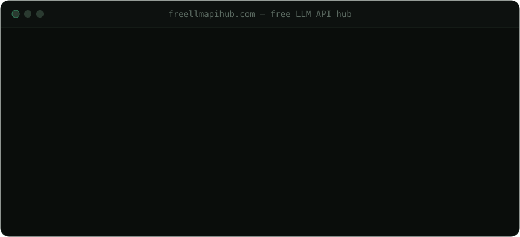

<div align="center">


**A continuously-verified dataset of free LLM & AI-model APIs you can build on.**

Free LLM APIs plus adjacent model APIs — image, speech, embeddings, rerank and OCR. Free tiers, trial credits and no-cost quotas, every entry dated, sourced, and machine-readable.
No hype, no dead links, no "generous limits" hand-waving. Just what's actually free, and the fine print that bites.



[](https://github.com/pacocartones/free-llm-api-hub/actions/workflows/verify.yml)
[](#how-verification-works)
[](docs/methodology.md)
[](https://freellmapihub.com/)
[](data/providers.json)
[](LICENSE)
[](CONTRIBUTING.md)
[](https://github.com/pacocartones/free-llm-api-hub/graphs/contributors)
[](https://github.com/pacocartones/free-llm-api-hub/issues?q=is%3Aissue+is%3Aopen+label%3A%22good+first+issue%22)

**[🔎 Interactive explorer](https://freellmapihub.com/)** &nbsp;·&nbsp; **[📊 Dataset](data/providers.json)** &nbsp;·&nbsp; **[🧪 How we verify](docs/methodology.md)** &nbsp;·&nbsp; **[➕ Add a provider](CONTRIBUTING.md)**


</div>

---

## Why this exists

Most "free LLM API" lists are a snapshot someone took once and never touched again. Rate limits get cut, docs URLs move, "free forever" quietly becomes "free for 30 days" — and the list keeps recommending it, confidently, for another year.

This project treats the list as a **maintained open dataset**, not a blog post:

- **Every entry is dated and sourced.** No `Last verified` date and a link to the provider's *own* docs? It doesn't ship as verified.
- **Freshness is measured, not claimed.** The badge above is computed from the data — it grades the *oldest* re-verification against the 90-day SLA, so it decays the moment maintenance stops. When it decays, you can see it.
- **Links are checked, not scheduled.** Every change runs the integrity gate, and each re-verification pass opens the provider's own docs — a dead source link is the earliest signal a provider changed something.
- **Uncertainty is labelled, not hidden.** Entries we couldn't independently confirm are marked ⚠️ and say exactly what's unconfirmed, instead of being dressed up as fact.
- **The data is the source of truth.** [`data/providers.json`](data/providers.json) is validated against a [schema](data/schema.json); this README, the badge and the site are all *generated* from it, so they can never silently drift apart.

If you're picking an API to prototype on this afternoon, you want the fine print more than the marketing. That's the whole point of this repo.

> [!WARNING]
> Independent, community-maintained list — **not affiliated with, endorsed by, or sponsored by any provider below.** Free-tier terms change without notice. Always confirm against the provider's own docs (linked in every row) before you rely on anything here. Entries marked ⚠️ are sourced from community tracking and not yet independently re-confirmed — treat them as indicative.

## What's covered

Primarily **free LLM (text) APIs** — plus the adjacent model APIs a builder reaches for next: **image generation, speech (STT/TTS), embeddings, rerank and OCR**. Every category is held to the same verification bar. Breakdown is generated from the data:

<!-- AUTOGEN:coverage:start -->
| Category | Providers | Examples |
|---|---|---|
| **Text / LLM** | 45 | Google Gemini API, Groq, OpenRouter |
| **Speech (STT / TTS)** | 26 | Google Gemini API, Groq, Cloudflare Workers AI |
| **Embeddings** | 13 | Google Gemini API, Cloudflare Workers AI, Cohere |
| **Image generation** | 11 | Cloudflare Workers AI, HuggingFace, OVHcloud AI Endpoints |
| **Vision** | 10 | Google Gemini API, OpenRouter, Z.ai |
| **OCR / documents** | 8 | OCR.space, LlamaParse, Nanonets |
| **Rerank** | 6 | Cohere, Jina AI, Mixedbread |
<!-- AUTOGEN:coverage:end -->

Filter any category live in the [interactive explorer](https://freellmapihub.com/) or the [multimodal collection](collections/multimodal.md).

## TL;DR — pick by what you actually need

Each pick links to its full verified profile on the live site.

| I want… | Start with | Why |
|---|---|---|
| **The smartest model, free** | [Google Gemini](https://freellmapihub.com/p/google-gemini) | The only genuinely frontier-class model with a real free tier here — not just open weights |
| **The fastest inference** | [Groq](https://freellmapihub.com/p/groq) or [SambaNova](https://freellmapihub.com/p/sambanova) | Purpose-built inference chips — far faster than typical GPU-served APIs |
| **The most free volume/day** | [Cloudflare Workers AI](https://freellmapihub.com/p/cloudflare-workers-ai) (10k Neurons) or [OpenRouter](https://freellmapihub.com/p/openrouter) (1k req/day) | Highest ceilings for a side project with real traffic |
| **No card *and* no phone** | [OpenRouter](https://freellmapihub.com/p/openrouter) or [Google Gemini](https://freellmapihub.com/p/google-gemini) | Groq, Mistral, SiliconFlow and NVIDIA all gate signup behind phone verification |
| **Open weights** (Llama, DeepSeek, Qwen, GLM) | [OpenRouter](https://freellmapihub.com/p/openrouter) or [Cloudflare Workers AI](https://freellmapihub.com/p/cloudflare-workers-ai) | Widest open-model selection on an ongoing free tier |
| **Permanently free, no trial clock** | [Z.ai (GLM)](https://freellmapihub.com/p/zai-glm), or [SiliconFlow](https://freellmapihub.com/p/siliconflow) if you can pass China real-name verification | Several models priced at $0 indefinitely, not just for a trial window |
| **An OpenAI-compatible endpoint** | [Groq](https://freellmapihub.com/p/groq), [OpenRouter](https://freellmapihub.com/p/openrouter), [Cloudflare Workers AI](https://freellmapihub.com/p/cloudflare-workers-ai) | Point the OpenAI SDK at a new `base_url` and you're done |
| **EU / data-sovereignty hosting** | [OVHcloud](https://freellmapihub.com/p/ovhcloud-ai-endpoints) or [Scaleway](https://freellmapihub.com/p/scaleway) | French/EU providers; OVHcloud even has an anonymous, no-account tier |
| **Free embeddings & rerank** | [Jina AI](https://freellmapihub.com/p/jina-ai) or [Cohere](https://freellmapihub.com/p/cohere) | 10M free tokens (Jina, OpenAI-compatible) or 1,000 calls/mo (Cohere) |
| **Free speech-to-text / TTS** | [Deepgram](https://freellmapihub.com/p/deepgram) or [AssemblyAI](https://freellmapihub.com/p/assemblyai) | $200 / $50 in no-card credit for Whisper-class STT and TTS |
| **A bigger one-time credit** | [Deepgram](https://freellmapihub.com/p/deepgram) ($200, speech) or [AI21 Labs](https://freellmapihub.com/p/ai21) ($10 for 3 months, LLMs) | Large one-time credits that start without a card |
| **Something safe to ship commercially** | [Cloudflare Workers AI](https://freellmapihub.com/p/cloudflare-workers-ai) or [Groq](https://freellmapihub.com/p/groq) | Don't restrict the free tier to personal/eval use, the way Cohere and NVIDIA do |

Starting points, not guarantees — read the full profile before you build on it.

## Browse by need

Focused, always-current collections — each is generated from the dataset and has a live web page too.

<!-- AUTOGEN:collections:start -->
- **[Free LLM APIs with no credit card](collections/no-credit-card.md)** (56) — start without a payment method · [live page ↗](https://freellmapihub.com/collections/no-credit-card)
- **[Free LLM APIs with no phone verification](collections/no-phone.md)** (22) — no SMS/phone verification · [live page ↗](https://freellmapihub.com/collections/no-phone)
- **[Free LLM APIs for commercial use](collections/commercial-use.md)** (25) — safe to ship, not eval-only · [live page ↗](https://freellmapihub.com/collections/commercial-use)
- **[OpenAI-compatible free LLM APIs](collections/openai-compatible.md)** (36) — drop-in OpenAI SDK swap · [live page ↗](https://freellmapihub.com/collections/openai-compatible)
- **[Permanently free LLM APIs](collections/always-free.md)** (5) — $0 models, no trial clock · [live page ↗](https://freellmapihub.com/collections/always-free)
- **[Free multimodal LLM APIs](collections/multimodal.md)** (52) — vision, audio, embeddings · [live page ↗](https://freellmapihub.com/collections/multimodal)
<!-- AUTOGEN:collections:end -->

Every provider also has its own page with the full details and a copy-ready quickstart — e.g. [Groq](https://freellmapihub.com/p/groq), [Deepgram](https://freellmapihub.com/p/deepgram), [Jina AI](https://freellmapihub.com/p/jina-ai).

## Contents

- [What's covered](#whats-covered) — the categories, by the numbers
- [Browse by need](#browse-by-need) — curated collections by constraint
- [The best free LLM APIs](#the-best-free-llm-apis) — our editorial top 20
- [Notably NOT free](#notably-not-free) — so this list doesn't waste your time
- [How verification works](#how-verification-works) — the trust engine
- [How this project is maintained](#how-this-project-is-maintained) — agents under human oversight
- [Use the data](#use-the-data) — dataset, exports, badge
- [Contributing](#contributing) · [Project docs](#project-docs)

---

## The best free LLM APIs

Our editorial top 20 — hand-picked from the [<!-- FIG:verified -->67<!-- /FIG --> verified providers](data/providers.json), ranked for real-world usefulness, not an automatic filter. Every row links to its full verified profile: free tier, rate limits and the catch are checked against the provider's own docs. The full editorial write-up is on the [**/best page ↗**](https://freellmapihub.com/best/).

<sub>💳 no card · 📵 no phone · 📱 phone required · 🏢 commercial OK · 🔬 eval only · 🔌 OpenAI-compatible</sub>

<!-- AUTOGEN:best:start -->
| Provider | What's free | The catch | Verified |
|---|---|---|---|
| **[Typhoon (SCB 10X)](https://docs.opentyphoon.ai/en/faq/)**<br><sub>🏆 Editor's pick</sub><br><sub>💳 no card · 📵 no phone · 🏢 commercial OK · 🔌 OpenAI-compat</sub> | Free to use research showcase API — all Typhoon models at $0 | By SCB 10X, the venture arm of Siam Commercial Bank, focused on Thai-language models. The free catalog spans LLMs (typhoon-v2.5-30b-a3b-instruct), OCR (typhoon-ocr family) and realtime Thai ASR (typhoon-asr-realtime, typhoon-isan-asr-realtime) — the hosted API is OpenAI-compatible, including audio transcriptions. Beta, provided as-is with no formal support; usage data is collected to improve the model; SCB claims no rights in outputs. Sign up for a free API key at opentyphoon.ai. | ✅ 2026-10-08 |
| **[Cloudflare Workers AI](https://developers.cloudflare.com/workers-ai/platform/pricing/)**<br><sub>🏆 Best free quota</sub><br><sub>💳 no card · 📵 no phone · 🏢 commercial OK · 🔌 OpenAI-compat</sub> | 10,000 Neurons/day, all account plans | Resets daily at 00:00 UTC; overage on a Workers Paid plan bills at $0.011/1,000 Neurons. A few models (e.g. Kimi K2.6/K2.7-code, GLM-5.2) now require a Workers Paid plan | ✅ 2026-10-08 |
| **[Google Gemini API (AI Studio)](https://ai.google.dev/gemini-api/docs/rate-limits)**<br><sub>🏆 Frontier quality</sub><br><sub>💳 no card · 📵 no phone · 🏢 commercial OK · 🔌 OpenAI-compat</sub> | Gemini 2.5 Flash, 2.5 Flash-Lite, 2.5 Pro (limited), embeddings, TTS models | Free-tier prompts/outputs may be used by Google to improve its products outside the UK/CH/EEA/EU. Since the 2026-03-23 terms, only Paid Services may serve API clients to end users in the EEA/CH/UK | ✅ 2026-10-08 |
| **[Ollama Cloud](https://docs.ollama.com/cloud)**<br><sub>🏆 Best on-ramp</sub><br><sub>📵 no phone · 🏢 commercial OK · 🔌 OpenAI-compat</sub> | $0 Free plan: starter amount of cloud usage credits, limited to a smaller set of starter models; buying credits unlocks all cloud models | First-party — Ollama hosts the cloud models. Requires an ollama.com account + API key. The old 5-hour session / weekly limits are gone: usage is now credit-based with a monthly reset; Pro ($20/mo) includes $60 of credits. Prompts/responses are not logged or trained on. Whether a card is required is not stated on the current pricing page. | ✅ 2026-10-08 |
| **[OpenRouter](https://openrouter.ai/docs/api-reference/limits)**<br><sub>🏆 Best gateway</sub><br><sub>💳 no card · 📵 no phone · 🏢 commercial OK · 🔌 OpenAI-compat</sub> | A rotating set of models with a :free suffix (16 on 2026-10-08; count fluctuates), single API across many providers | ToS (Jul 2026) prohibits reselling API access or building a competing service — platform-wide, not just the free models; per-model terms still apply | ✅ 2026-10-08 |
| **[AI Horde](https://aihorde.net/)**<br><sub>🏆 No account needed</sub><br><sub>💳 no card · 📵 no phone</sub> | Free crowdsourced text & image generation; anonymous API key '0000000000' (no registration), or register to earn kudos for priority | Community-powered volunteer network — model availability and speed vary with worker supply, so it is not a fixed-SLA service. No card, no phone. Kudos never expire and cannot be sold. | ✅ 2026-10-08 |
| **[LlamaParse (LlamaCloud)](https://www.llamaindex.ai/pricing)**<br><sub>🏆 Best for RAG</sub><br><sub>💳 no card · 📵 no phone · 🏢 commercial OK</sub> | Free plan: 10,000 credits/month (up to ~10,000 pages at the cheapest parse tier, as low as 1 credit/page) | Credit-based (1,000 credits = $1.25); premium parse modes consume more credits per page. No card required. Document parsing for RAG (LlamaIndex). | ✅ 2026-10-08 |
| **[OCR.space](https://ocr.space/OCRAPI)**<br><sub>🏆 Reliable utility</sub><br><sub>💳 no card · 📵 no phone · 🏢 commercial OK</sub> | 25,000 conversions/month (Engine 1 & 2) plus 1,000 Engine 3 conversions/month; max 1 MB file, PDFs up to 3 pages | Free searchable-PDF output carries a watermark (raw text extraction is unrestricted); the free key needs only an email, no card. Commercial use permitted. | ✅ 2026-10-08 |
| **[Speechify API](https://speechify.ai/pricing)**<br><sub>🏆 Best for TTS</sub><br><sub>💳 no card · 📵 no phone · 🏢 commercial OK</sub> | 500K characters/month TTS (hard cap; pauses until next month), catalog voices, streaming and SSML | Commercial use is allowed on the free tier. No credit card required. Free cannot top up and pauses when the monthly balance runs out. Voice cloning is paid-plan only; voice agents are now an enterprise-only product (no free minutes). | ✅ 2026-10-08 |
| **[Jina AI](https://jina.ai/embeddings/)**<br><sub>🏆 Best for embeddings</sub><br><sub>💳 no card · 📵 no phone · 🏢 commercial OK · 🔌 OpenAI-compat</sub> | 10M free tokens (one-time) across all models — embeddings, rerankers, classifier; plus a keyless Reader (r.jina.ai) for basic use | The 10M-token balance is a one-time grant that does not replenish; the keyless Reader is genuinely ongoing. Hosted API is commercial-OK and data is not used for training. No card required. | ✅ 2026-10-08 |
| **[Deepgram](https://deepgram.com/pricing)**<br><sub>🏆 Best STT credit</sub><br><sub>💳 no card · 📵 no phone · 🏢 commercial OK</sub> | $200 free credit on signup (no card, no expiration) — Nova speech-to-text and Aura text-to-speech at pay-as-you-go rates | No card and no expiration on the credit. Data catch: the Model Improvement Program is opt-OUT — send mip_opt_out=true per request to keep your data out of training. Native REST/WebSocket API, not OpenAI-compatible. | ✅ 2026-10-08 |
| **[Groq](https://console.groq.com/docs/rate-limits)**<br><sub>🏆 Fastest inference</sub><br><sub>💳 no card · 📱 phone · 🏢 commercial OK · 🔌 OpenAI-compat</sub> | Open-weight models (GPT-OSS, Qwen) plus Whisper, no credit card required | Limits apply at the organization level, not per API key. Phone verification required at signup | ✅ 2026-10-08 |
| **[SambaNova Cloud](https://cloud.sambanova.ai/plans)**<br><sub>🏆 Fast, no card</sub><br><sub>🏢 commercial OK · 🔌 OpenAI-compat</sub> | Rate-limited free tier (applies when no payment method is linked) across the models listed in the Free Tier table | Free Tier applies when no payment method is linked to the account; SambaCloud ToS grants a commercial license (no evaluation-only clause). The previously-listed "$5 / 3 months" trial could not be re-confirmed on official pages (2026-07-30). card_required is unconfirmed because SambaNova's own pages disagree (read 2026-10-08): the rate-limits doc (https://docs.sambanova.ai/docs/en/models/rate-limits) says "Free Tier: Applied when there is no payment method linked with your account", while the plans page (https://cloud.sambanova.ai/plans) says "Add a payment method and purchase credits to run your first requests". Settling it needs a real signup, which is not done without the Owner's OK. The rate-limits doc (read 2026-10-09) also lists two preview models on the Free Tier at the same 20 RPM / 20 RPD / 200,000 TPD (DeepSeek-V3.2, gemma-4-31B-it), described there as having limited capacity and removable at short notice; they are not in models_free. | ✅ 2026-10-09 |
| **[W&B Inference](https://docs.coreweave.com/products/inference/serverless/usage-limits)**<br><sub>🏆 Frontier open models, one key</sub><br><sub>💳 no card · 🏢 commercial OK · 🔌 OpenAI-compat</sub> | Serverless Inference credits on the Free plan "for a limited time" (amount not published); Free accounts have a default spending cap of $100/month | W&B Inference is now documented as CoreWeave Forge Serverless Inference (docs.wandb.ai redirects to docs.coreweave.com). The $100/month figure is a default spending cap, not a stated free-credit amount. When credits run out, Free accounts must activate pay-as-you-go on the Billing tab or upgrade; CoreWeave requires prepayment for paid access. Available only from supported geographic locations. OpenAI-compatible endpoint at api.inference.wandb.ai/v1; API keys are created at forge.coreweave.com. The pricing page lists "$5/mo free credit for a limited time" only under Pro and "Billed monthly" under Free, so the Free amount is unclear. | ✅ 2026-10-08 |
| **[Voyage AI](https://docs.voyageai.com/docs/pricing)**<br><sub>🏆 Best embedding allotment</sub><br><sub>💳 no card</sub> | 200M free tokens per model on current embedding models (voyage-4-large, voyage-4, voyage-4-lite, voyage-context-4, voyage-code-4) and on the rerankers listed in the price table (rerank-3, rerank-3-lite); voyage-multimodal-3.5 and voyage-multimodal-3 get 200M text tokens + 150B pixels; legacy voyage-finance-2, voyage-law-2 and voyage-code-2 get 50M — a one-time complimentary allotment per account | The allotment is a one-time complimentary balance per model, not a renewing monthly quota. Free tokens do not apply to Batch API usage. Voyage's pricing page is internally inconsistent on rerankers: the prose still names the rerank-2.5/rerank-2 families as free, while the price table gives 200M free tokens to rerank-3 and rerank-3-lite and lists rerank-2.5 under older models with no free tokens. No credit card required to claim. Owned by MongoDB — a first-party model provider, not a proxy. | ✅ 2026-10-08 |
| **[Pinecone Inference](https://www.pinecone.io/pricing/)**<br><sub>🏆 Best managed embeddings</sub><br><sub>💳 no card</sub> | Starter (free) plan: 5M embedding tokens/month per model (llama-text-embed-v2, multilingual-e5-large, pinecone-sparse-english-v0) and 500 rerank requests/month (bge-reranker-v2-m3; the rate-limits doc also lists pinecone-rerank-v0 at 500) | Monthly limits are hard: reaching one returns 429 and you must upgrade (no pay-as-you-go overage on Starter). The pricing page lists only bge-reranker-v2-m3 as included on Starter while the rate-limits doc also lists pinecone-rerank-v0 at 500 — an internal inconsistency. Not OpenAI-compatible. Card requirement for Starter not stated on the pricing page or docs. No card was required at signup when last confirmed (2026-08); the current pages do not mention it. | ✅ 2026-10-08 |
| **[Pollinations.ai](https://gen.pollinations.ai/docs)**<br><sub>🏆 Free credits via Quests</sub><br><sub>💳 no card · 📵 no phone · 🔌 OpenAI-compat</sub> | Quest Pollen: create an account, complete eligible Quests on the Quests dashboard and claim the rewards; Quest Pollen is spent before paid Pollen on regular (non-paid-only) models. No anonymous/no-key generation — every generation endpoint requires an API key and costs Pollen ($1 ≈ 1 Pollen). Text, image, video, audio, embeddings and 3D models behind one OpenAI-compatible API | The old anonymous 1 req/15s and Seed 1 req/5s tiers (and the watermark/nologo scheme) are gone from the current docs; the API moved to gen.pollinations.ai with keys from enter.pollinations.ai. Quest availability and reward amounts change ("the dashboard and the linked issue are the source of truth"). No credit card needed to try. Paid-only models require Paid Pollen. Commercial use is not explicitly addressed in the docs. The previous docs_url pointed at the stale master branch; the default branch is main. | ✅ 2026-10-08 |
| **[Moondream Cloud](https://moondream.ai/pricing)**<br><sub>🏆 Best tiny vision</sub><br><sub>💳 no card · 🔌 OpenAI-compat</sub> | $5/month usage credits in every workspace (Free plan) for the Moondream vision model — caption, query (VQA), detect, point | Recurring $5/month credit, no credit card required. Per the Terms (§5.2), data is not used to train Moondream's generally available models. Commercial terms for the hosted API not specified. OpenAI-compatible endpoint. | ✅ 2026-10-08 |
| **[Unstructured](https://unstructured.io/pricing)**<br><sub>🏆 Best doc pipeline</sub><br><sub>💳 no card</sub> | 10,000 free pages once per account — document parsing/OCR (layout, tables, generative OCR enrichment); then $0.015/page pay-as-you-go | No credit card required. The free pages are a one-time credit per account (not monthly); after 10,000 pages, processing requests fail until you upgrade to Pay-As-You-Go. Purpose-built to turn documents into clean, structured input for RAG/LLM pipelines. Commercial terms not stated on the pricing page. | ✅ 2026-10-08 |
| **[Scaleway Generative APIs](https://www.scaleway.com/en/pricing/model-as-a-service/)**<br><sub>🏆 Best EU open models</sub><br><sub>💳 no card · 🔌 OpenAI-compat</sub> | 1,000,000 tokens free + 60 min Whisper transcription; billing starts at token 1,000,001 | European provider (France). Free allowance is a one-time token bucket, not time-limited. Official rate limits apply once a valid payment method is registered; identity verification raises them. | ✅ 2026-10-08 |
<!-- AUTOGEN:best:end -->

That's the shortlist. The full dataset — all <!-- FIG:providers -->68<!-- /FIG --> providers, every ongoing tier and one-time credit, filterable and machine-readable — lives in [**data/providers.json**](data/providers.json) and the [interactive explorer ↗](https://freellmapihub.com/).

## Notably NOT free

Worth saying plainly. As of the last verification pass, **OpenAI, Anthropic and xAI do not offer an ongoing free API tier.** Several providers people *assume* are free — **Together AI, DeepInfra, Perplexity's API, Replicate, Featherless AI** — currently require a card or prepayment before any API use, per their own docs. Some have handed out small one-time trial credits at various points, but that's changed repeatedly; check each provider's billing page before assuming anything.

For genuinely free access to strong models, your best bets here are **Gemini** (frontier-class) and the free open-weight models on **Groq, OpenRouter, Cloudflare and Z.ai** (SiliconFlow's free models are on its China platform and need real-name verification).

Retired or removed after re-verification: **GitHub Models** (fully retired by GitHub on 2026-07-30 — playground, catalog and inference API shut down for all customers), **Cerebras** (now listed as a trial credit: the ongoing free tier became a payment-method-gated $5/30-day trial), **Inference.net** (the free tier is gateway/observability only, not free model tokens), and **Hyperbolic** (requires a $5 minimum deposit before any use).

## How verification works

Free-tier terms move fast, and most lists go stale silently. This one is built to surface drift instead of hiding it. Full details in **[docs/methodology.md](docs/methodology.md)**; the short version:

1. **Every verified entry carries a `last_verified` date** and a link to the provider's *own* docs. No date + primary source → it ships as ⚠️ unverified, not as fact.
2. **A local re-verification pass** ([docs/update-playbook.md](docs/update-playbook.md)) re-checks each provider's own docs on a rolling basis — a dead or changed source is an early warning that a provider changed something.
3. **The freshness badge is computed from the data,** not written by hand: it is graded on the **oldest** verification in the list, straight from [`providers.json`](data/providers.json). Green while every entry is under 60 days old, amber once any entry is due for re-verification, red once any entry breaches the 90-day SLA. One forgotten row is enough to move it — which is the point.
4. **The dataset is schema-validated in CI.** A verified entry that's missing its date or source link fails the build — the honesty rule is enforced by machine, not by good intentions.
5. **Reporting a stale entry takes under a minute** via a [structured form](../../issues/new?template=inaccuracy.yml) that asks for the provider, what changed and a source link.

What "verified" covers and where its limits are: [docs/methodology.md](docs/methodology.md) · what earns a spot on the list: [docs/inclusion-criteria.md](docs/inclusion-criteria.md).

## How this project is maintained

Much of the routine maintenance of this repository is done by AI agents working under human oversight: they re-check provider sources, prepare data updates, triage issues and draft code. Every change still goes through a pull request, a human maintainer reviews it and is responsible for every merge, and every data change carries a link to the provider's own page and the date it was checked. Commit messages carry no AI signature or trailer; this section is where we say it.

## Use the data

This is meant to be consumed by machines as much as by humans.

- **[`data/providers.json`](data/providers.json)** — canonical dataset, validated against [`data/schema.json`](data/schema.json). Every field explained in [docs/comparison-dimensions.md](docs/comparison-dimensions.md).
- **Static JSON API** — [the public JSON dataset](https://freellmapihub.com/providers.json) and the versioned [JSON API](https://freellmapihub.com/api/) are generated from the canonical dataset for programmatic use.

```bash
# Every ongoing free tier that needs neither a card nor a phone number:
curl -s https://raw.githubusercontent.com/pacocartones/free-llm-api-hub/main/data/providers.json \
  | jq -r '.providers[]
      | select(.category=="ongoing" and .card_required==false and .phone_required==false)
      | .name'
```

**Pin a snapshot for reproducible builds.** `main` moves; depend on an immutable tag instead:

```bash
curl -s https://raw.githubusercontent.com/pacocartones/free-llm-api-hub/v2.9.1/data/providers.json
```

Tags track the dataset `version` in [`data/providers.json`](data/providers.json) (see [CHANGELOG.md](CHANGELOG.md)) — pin `vX.Y.Z` and bump deliberately. The [live JSON API](https://freellmapihub.com/api/v1/providers.json) always serves the latest `main`.

**Vouch for the data from your own README** — embed the live freshness badge:

```markdown
[](https://github.com/pacocartones/free-llm-api-hub)
```

It renders the real, auditable age of the oldest entry in the list — not a static "as of some date I forgot to update" number, and not a share that only moves after the project has been dead for a season.

**Embed a live widget** on any site — a compact, always-current list of the top verified free APIs:

```html
<div id="flh-widget" data-count="6" data-modality="text"></div>
<script src="https://freellmapihub.com/widget.js" async></script>
```

Self-contained (inline styles, no CSS conflicts). All attributes are optional: `data-count` (1-20, default 6), `data-modality` (`text`, `audio`, `embeddings`, `image`, `vision`, `ocr`, `rerank`), `data-category` (`ongoing` or `trial`; default both), `data-sort` (an explorer sort key - `recommended` (default), `name`, `category`, `free_tier`, `notes`, `verified`).

**Follow changes** — [updates page](https://freellmapihub.com/updates) or the [RSS feed](https://freellmapihub.com/feed.xml).

## Contributing

Found an outdated limit, a dead link, or a provider that belongs here? You'll keep this useful for everyone.

- **Fastest:** the [structured issue form](../../issues/new?template=inaccuracy.yml) — provider, what changed, a source link.
- **Or open a PR** editing only [`data/providers.json`](data/providers.json). Run `npm run build` to regenerate the README and badge, and `npm test` to validate. Never hand-edit the tables — they're generated.

Full guidelines, including what counts as an acceptable source: **[CONTRIBUTING.md](CONTRIBUTING.md)**.

### AI-assisted contributions are welcome

Use AI tools if they help you — we do too. We ask for good judgement: understand and test what you send, and check every fact at its source. See [AI_POLICY.md](AI_POLICY.md).

## 🙋 Contributions wanted right now

This dataset is only as good as it is trustworthy, and right now there are `null` fields (= "nobody has confirmed it yet") waiting for a source. Three concrete ways to help, from smallest to biggest:

1. Grab a [*good first issue*](https://github.com/pacocartones/free-llm-api-hub/issues?q=is%3Aissue+is%3Aopen+label%3A%22good+first+issue%22) and confirm **a single fact** about one provider (e.g. *"does Cerebras require a phone?"*) from its official site, with today's date. It's a one-line diff in [`data/providers.json`](data/providers.json).
2. Pick a provider from the umbrella issue [**confirm `phone_required`**](https://github.com/pacocartones/free-llm-api-hub/issues/7).
3. Do the same for [**confirm `commercial_ok`**](https://github.com/pacocartones/free-llm-api-hub/issues/8), reading the provider's terms.

The rule is simple and honest: primary source (the provider's own docs) + `last_verified` with a real date, and if you're not sure, leave it `null` and say so. Comment on an issue to claim it and a maintainer will assign it to you.

**Hacktoberfest:** this repository takes part. Merged pull requests are labelled `hacktoberfest-accepted`. One sourced fact beats ten cosmetic edits; see [CONTRIBUTING.md](CONTRIBUTING.md#hacktoberfest).

## Contributors

Thanks to everyone who has verified an entry, fixed a link, or improved the project:

<!-- AUTOGEN:contributors:start -->
- [Jhansi Oruganti](https://github.com/JhansiOruganti-43) — data: confirm Novita AI free tier is not commercial-use allowed ([PR #27](https://github.com/pacocartones/free-llm-api-hub/pull/27))
- [Victoria Odalo](https://github.com/OdaloV) — docs: verify Clarifai commercial_ok status ([PR #112](https://github.com/pacocartones/free-llm-api-hub/pull/112))
- [MikeGatsby](https://github.com/MikeGatsby) — data: verify Datalab hosted-API commercial-use terms (no explicit statement found) ([PR #117](https://github.com/pacocartones/free-llm-api-hub/pull/117))
- [bcabreraike-cmyk](https://github.com/bcabreraike-cmyk) — docs: explain paced re-verification batches ([PR #169](https://github.com/pacocartones/free-llm-api-hub/pull/169))
- [Swarnabha Nandi](https://github.com/Swarnabha753) — fix: show clear button when sort is changed ([PR #183](https://github.com/pacocartones/free-llm-api-hub/pull/183))
- [Manan Bharti](https://github.com/mananbharti) — test: check serializer ORDER against the provider schema ([PR #201](https://github.com/pacocartones/free-llm-api-hub/pull/201))
- [Piyush](https://github.com/piyusshhjangid) — data: verify Datalab phone requirement and free-tier rate limit ([PR #198](https://github.com/pacocartones/free-llm-api-hub/pull/198))
<!-- AUTOGEN:contributors:end -->

## Project docs

| Doc | What it covers |
|---|---|
| [Methodology](docs/methodology.md) | How each entry is verified; what "verified" does and doesn't mean |
| [Update playbook](docs/update-playbook.md) | The weekly routine that keeps the badge green |
| [Inclusion criteria](docs/inclusion-criteria.md) | What earns a spot — and what gets rejected |
| [Comparison dimensions](docs/comparison-dimensions.md) | Every field and flag in the dataset, defined |
| [Self-hosting on free compute](docs/self-hosting-on-free-compute.md) | Adjacent: free GPU/compute when no hosted API fits |
| [Credit programs (apply to get)](docs/credit-programs.md) | Adjacent: startup & student/research credit programs |
| [Roadmap](docs/roadmap.md) | Where this is going next |
| [AI policy](AI_POLICY.md) | AI-assisted contributions are welcome; what we ask in return |
| [Changelog](CHANGELOG.md) | What changed, when |
| [Governance](GOVERNANCE.md) | How decisions get made |
| [Security](SECURITY.md) · [Code of Conduct](CODE_OF_CONDUCT.md) | Reporting & community norms |

## License

[MIT](LICENSE) — free to reuse, fork, and adapt, including the dataset. A link back is appreciated but not required.

